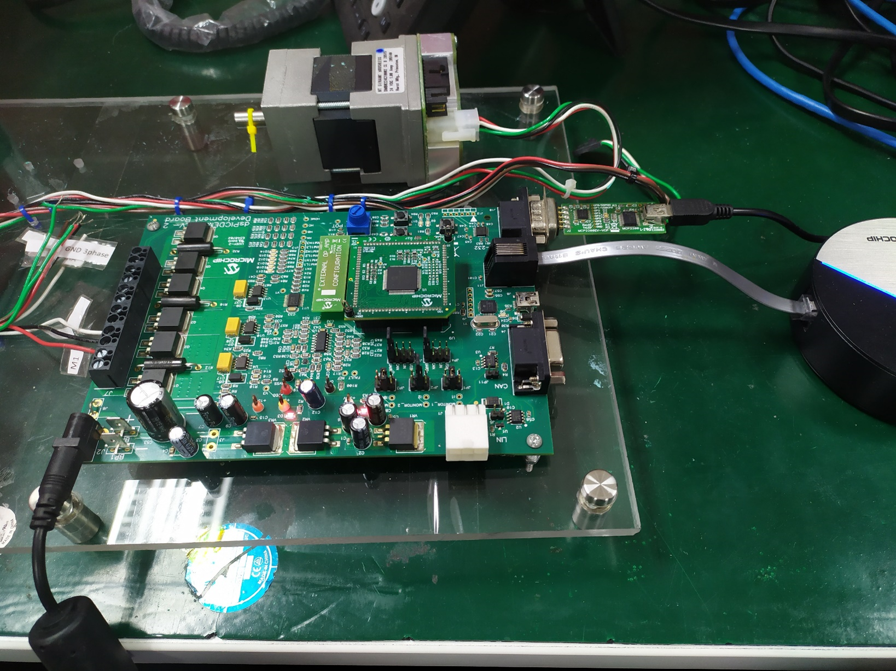

 

## AN1160 Demo Guide on MCLV2

## Summary
This document describes the setup requirements for running the Sensorless BLDC Motor Control Algorithm, which is referenced in AN1160 “Sensorless BLDC Control with Back-EMF Filtering Using a Majority Function” using a dsPICDEM™ MCLV-2 Development Board in the External Op Amp configuration.
The demonstration is configured to run on the dsPICDEM™ MCLV-2 Development Board (DM330021-2) in External Op-amp configuration with the dsPIC33CK256MP508 External Op-Amp Motor Control Plug-In Module (PIM) (MA330041-1).

## Related Documentation
* [AN1160: Sensorless BLDC Control with Back-EMF Filtering Using a Majority Function](https://ww1.microchip.com/downloads/aemDocuments/documents/MCU16/ApplicationNotes/ApplicationNotes/AN1160-Sensorless-BLDC-Control-with-Back-EMF-Filtering-Using-a-Majority-Function-DS00001160.pdf)

## Software Used 
* MPLAB® X IDE v5.50 
* MPLAB® XC16 Compiler v1.41
* MPLAB® X IDE Plugin: X2C-Scope v1.3.0 or later

## Hardware Used
* dsPICDEM™ MCLV-2 Development Board (DM330021-2)
* 24V Power Supply (AC002013) 
* 24V 3-Phase Brushless DC Motor (AC300020) 
* dsPIC33CK256MP508 External Op-Amp Motor Control Plug-in module (MA330041-1)

## Setup
Refer to AN1160_Readme document included in this project inside the docs folder. 

